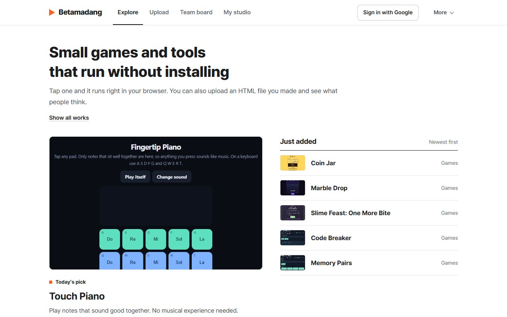
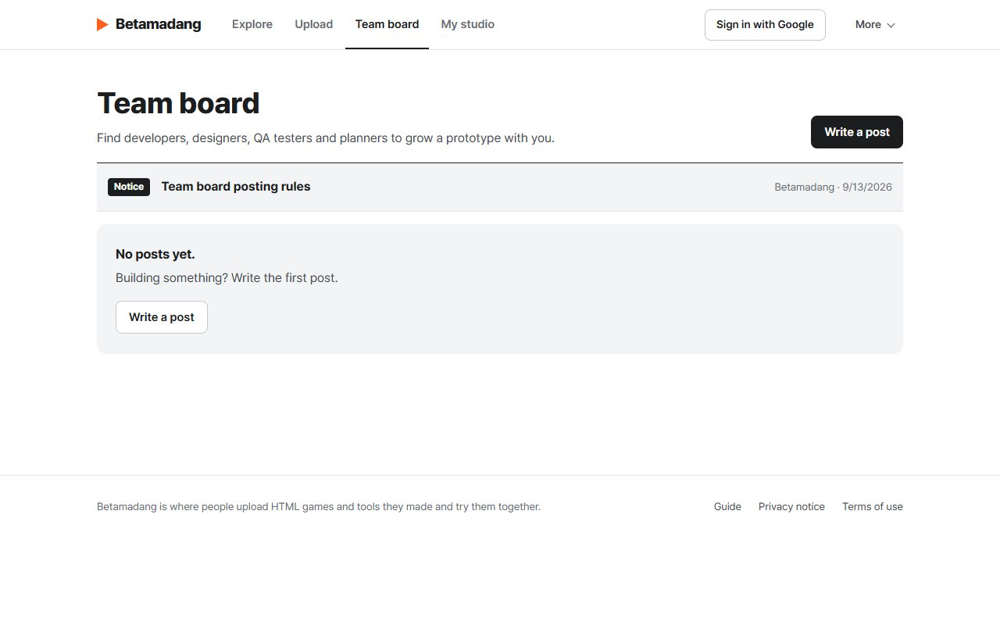
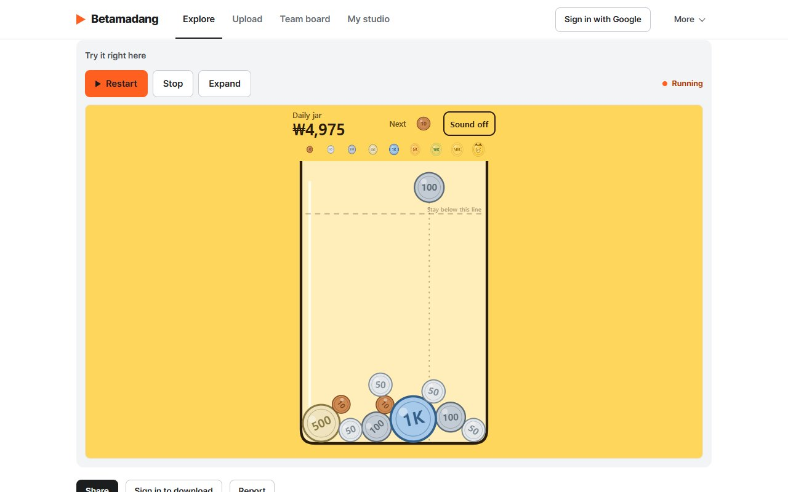
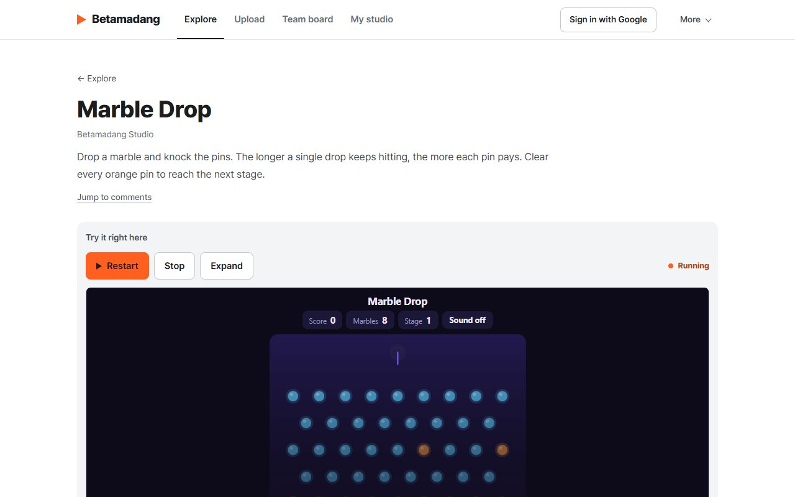
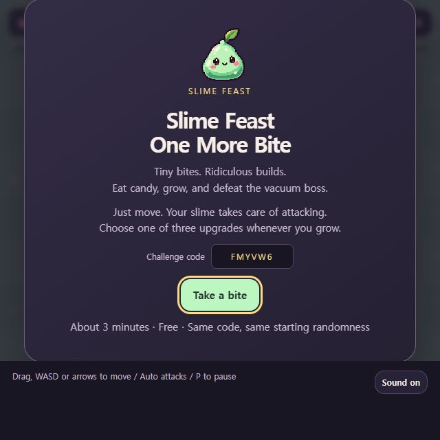

# Betamadang

### Small tools, playful experiments, and a team for your prototype.

Betamadang is a free collection of small HTML games and tools that run right in the browser, with no install or sign-up. Sign in with Google to upload a single HTML file (up to 800KB), get feedback in the comments, and find people for development, design, QA, and planning on the team board. It is available in Korean and English.

[Explore in English](https://betamadang.web.app/en/?utm_source=github&utm_medium=readme&utm_campaign=team_launch) · [한국어로 둘러보기](https://betamadang.web.app/?utm_source=github&utm_medium=readme&utm_campaign=team_launch)

No installation or sign-in is needed to try a public work. Google sign-in unlocks uploads, downloads, comments, and team posts.

## New: find a team for your prototype

Have something that already runs but needs more hands? Post it on the team board and say who you are looking for. It is one board with role tags for **Development, Design, QA, and Planning**, so every post is in the same place and you can filter by the role you offer.

[Open the team board](https://betamadang.web.app/en/team?utm_source=github&utm_medium=readme&utm_campaign=team_launch) · [팀 모집 게시판](https://betamadang.web.app/team?utm_source=github&utm_medium=readme&utm_campaign=team_launch) · [Read the posting rules](https://betamadang.web.app/en/team/posting-rules-en?utm_source=github&utm_medium=readme&utm_campaign=team_launch)

- Start a post straight from your work page with **Find teammates**, so people can try the prototype before they reply.
- People apply in the comments, or through a KakaoTalk open chat link if you choose to share one.
- Keep phone numbers, emails, and other personal details out of posts. Betamadang does not collect, hold, or guarantee payments between members.
- Close your post once you have found your team.

## Start with a little surprise

### Coin Jar

Drop coins into a jar. Two matching coins that touch become the next denomination, from 10 won all the way to a golden pig. The daily jar drops the same coins for everyone that day, so you can compare totals with friends.

[Play in English](https://betamadang.web.app/en/play/coin-jar?utm_source=github&utm_medium=readme&utm_campaign=coin_jar) · [한국어로 플레이](https://betamadang.web.app/play/coin-jar?utm_source=github&utm_medium=readme&utm_campaign=coin_jar)

### Marble Drop

Aim, drop a marble, and let it fall through a field of pins. Every pin a single drop hits raises the multiplier, so one lucky cascade can beat ten careful shots. Clear every orange pin to reach the next stage.

[Play in English](https://betamadang.web.app/en/play/marble-drop?utm_source=github&utm_medium=readme&utm_campaign=team_launch) · [한국어로 플레이](https://betamadang.web.app/play/marble-drop?utm_source=github&utm_medium=readme&utm_campaign=team_launch)

### Slime Feast — One More Bite

Move a tiny slime, collect candy, and combine upgrades into a ridiculous build. Tiny twins inherit your sneeze attack; pudding dashes chain lightning. Survive long enough to face the vacuum boss.

[Play in English](https://betamadang.web.app/en/play/slime-feast?utm_source=github&utm_medium=readme&utm_campaign=slime_launch) · [한국어로 플레이](https://betamadang.web.app/play/slime-feast?utm_source=github&utm_medium=readme&utm_campaign=slime_launch)

| Turn your name into a galaxy | Play a tune with your fingertips | Test your memory |
|---|---|---|
|  |  |  |

Explore **33 English Studio works**, from tiny games to everyday utilities. The newest ones appear first on the home page.

## Pick your first experiment

| Experiment | What it does | Try it |
|---|---|---|
| Percent Lab | Discounts, percentages, and a formula you can check | [Open](https://betamadang.web.app/en/play/percent-lab?utm_source=github&utm_medium=readme) |
| Unit Desk | Convert length, weight, and temperature | [Open](https://betamadang.web.app/en/play/unit-desk?utm_source=github&utm_medium=readme) |
| Text Cleanroom | Remove duplicate lines and clean up spaces | [Open](https://betamadang.web.app/en/play/text-cleanroom?utm_source=github&utm_medium=readme) |
| Memory Pairs | Match symbols with fewer attempts | [Play](https://betamadang.web.app/en/play/memory-pairs?utm_source=github&utm_medium=readme) |
| Code Breaker | Crack four different digits in ten guesses | [Play](https://betamadang.web.app/en/play/code-breaker?utm_source=github&utm_medium=readme) |

The [examples](examples/) folder contains these five English HTML files. Open one in a browser to try it locally. They use no external libraries or network calls.

## Build a work with your AI assistant

Many works start as a conversation with an AI assistant. Works run in a sandboxed frame, so a few browser features are unavailable there: storage (localStorage, sessionStorage, IndexedDB, cookies), alert, confirm, prompt, window.open, form submission, external images, fonts, scripts, and API requests, iframes, eval, WebAssembly, and workers. Canvas, WebGL, Web Audio, and keyboard, mouse, and touch input all work.

The [guide](https://betamadang.web.app/en/guide?utm_source=github&utm_medium=readme&utm_campaign=agents) lists these limits and includes a prompt you can paste into your assistant, plus the one-line message a game sends to turn its score into a share card. Try the file in a browser first, then upload it.

## From idea to team

1. Build a single HTML file.
2. [Upload it](https://betamadang.web.app/en/submit?utm_source=github&utm_medium=readme), preview it, and publish it.
3. Let people try it and exchange feedback through comments and replies.
4. When it needs more hands, [post on the team board](https://betamadang.web.app/en/team?utm_source=github&utm_medium=readme&utm_campaign=team_launch) and link the work.
5. Update your HTML and thumbnail as the idea grows.

The site interface supports Korean and English. Creator-written content, including team posts, stays in its original language. The English Studio collection includes translated controls and instructions. Studio examples do not accept site comments; [open an issue here](https://github.com/suhwan-kim2/betamadang-showcase/issues) to share feedback.

## Current beta limits

Single HTML files up to 800KB. Each account can upload three works and write two team posts per Korea calendar day. Uploaded works run in a restricted iframe. External APIs and secret keys are not supported. @mentions identify reply recipients but do not send notifications.

This is the public showcase, not the private service repository. No community account data is included. There is no blanket license granting redistribution rights to other people’s uploads.

## 한국어

베타마당은 설치나 가입 없이 브라우저에서 바로 실행되는 작은 HTML 게임과 도구를 모아둔 곳입니다. Google 로그인 후 HTML 파일 하나(최대 800KB)를 올려 댓글로 피드백을 받고, 팀 모집 게시판에서 개발·디자인·QA·기획을 함께할 사람을 찾을 수 있습니다. 무료이며 한국어와 영어로 볼 수 있습니다.

- 체험은 로그인 없이, 업로드·댓글·모집글은 Google 로그인 후 쓸 수 있습니다.
- 팀 모집은 게시판 하나에 역할 표시를 달아 모읍니다. 작품 페이지의 "팀원 구해요"로 바로 모집글을 쓸 수 있습니다.
- 연락은 댓글이나 카카오 오픈채팅으로 주고받습니다. 연락처와 개인정보는 본문에 적지 않고, 베타마당은 돈 거래를 중간에서 받거나 보증하지 않습니다.

[짤랑 저금통](https://betamadang.web.app/play/coin-jar?utm_source=github&utm_medium=readme&utm_campaign=coin_jar) · [작품 만들어 올리는 법](https://betamadang.web.app/guide?utm_source=github&utm_medium=readme&utm_campaign=agents) · [베타마당 둘러보기](https://betamadang.web.app/?utm_source=github&utm_medium=readme&utm_campaign=team_launch) · [팀 모집 게시판](https://betamadang.web.app/team?utm_source=github&utm_medium=readme&utm_campaign=team_launch) · [글쓰기 규칙](https://betamadang.web.app/team/posting-rules?utm_source=github&utm_medium=readme&utm_campaign=team_launch)

오류가 있다면 작품 주소와 재현 방법을 Issues에 남겨주세요.
