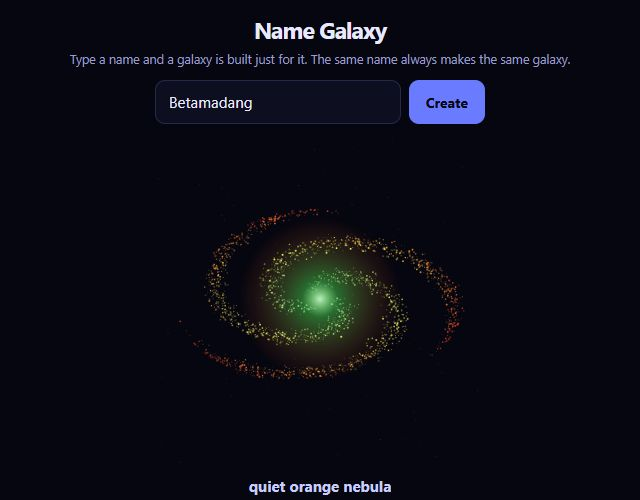
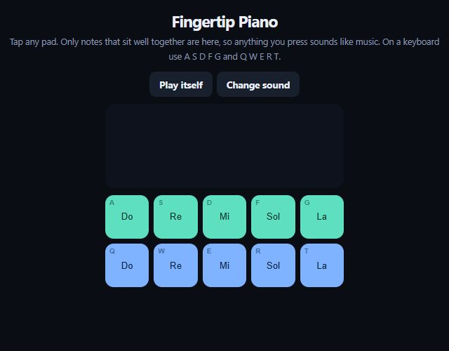
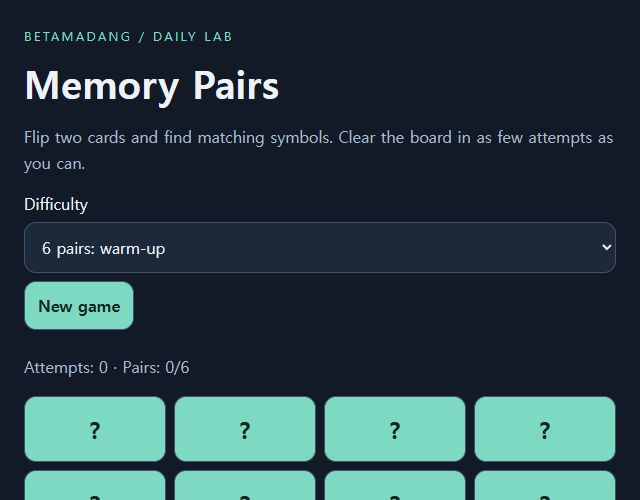

# Betamadang

### Small tools. Playful experiments.

A quick calculation. A tidier list. One more round of a game. **Try small HTML creations in your browser, then share what you make.**

[Explore in English](https://betamadang.web.app/en/?utm_source=github&utm_medium=readme&utm_campaign=english_launch) · [한국어로 둘러보기](https://betamadang.web.app/?utm_source=github&utm_medium=readme&utm_campaign=english_launch)

No installation or sign-in is needed to try a public work. Google sign-in unlocks uploads, downloads, and comments on community works.

## Start with a little surprise

| Turn your name into a galaxy | Play a tune with your fingertips | Test your memory |
|---|---|---|
|  |  |  |

Explore **30 English Studio experiments**, from tiny games to everyday utilities. Find an idea worth trying—or bring your own.

## Pick your first experiment

| Experiment | What it does | Try it |
|---|---|---|
| Percent Lab | Discounts, percentages, and a formula you can check | [Open](https://betamadang.web.app/en/play/percent-lab?utm_source=github&utm_medium=readme) |
| Unit Desk | Convert length, weight, and temperature | [Open](https://betamadang.web.app/en/play/unit-desk?utm_source=github&utm_medium=readme) |
| Text Cleanroom | Remove duplicate lines and clean up spaces | [Open](https://betamadang.web.app/en/play/text-cleanroom?utm_source=github&utm_medium=readme) |
| Memory Pairs | Match symbols with fewer attempts | [Play](https://betamadang.web.app/en/play/memory-pairs?utm_source=github&utm_medium=readme) |
| Code Breaker | Crack four different digits in ten guesses | [Play](https://betamadang.web.app/en/play/code-breaker?utm_source=github&utm_medium=readme) |

The [examples](examples/) folder contains these five English HTML files. Open one in a browser to try it locally. They use no external libraries or network calls.

## From idea to feedback

1. Build one HTML file with your AI coding tool.
2. [Upload it](https://betamadang.web.app/en/submit?utm_source=github&utm_medium=readme), preview it, and publish it.
3. Let people try it and exchange feedback through comments and replies.
4. Update your HTML and thumbnail as your idea improves.

The site interface supports Korean and English. Creator-written content stays in its original language. The English Studio collection includes translated controls and instructions. Studio examples do not accept site comments; [open an issue here](https://github.com/suhwan-kim2/betamadang-showcase/issues) to share feedback.

## Current beta limits

Single HTML files up to 800KB; three uploads per account per Korea calendar day. Uploaded works run in a restricted iframe. External APIs and secret keys are not supported. @mentions identify reply recipients but do not send notifications.

This is the public showcase, not the private service repository. No community account data is included. There is no blanket license granting redistribution rights to other people’s uploads.

## 한국어

베타마당은 작은 HTML 도구와 게임을 직접 실행하고 공유하는 공간입니다. 로그인 없이 체험하고, Google 로그인 후 업로드·댓글·답글을 사용할 수 있습니다. 오류가 있다면 작품 주소와 재현 방법을 Issues에 남겨주세요.
